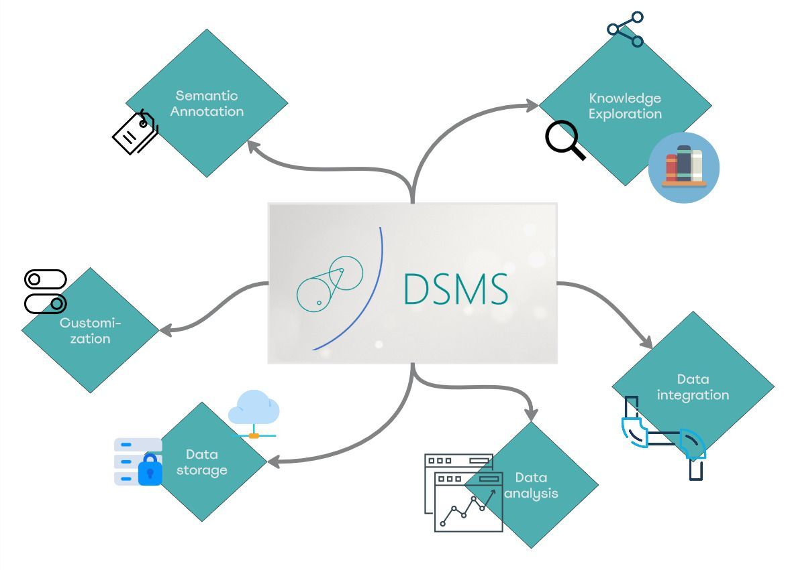
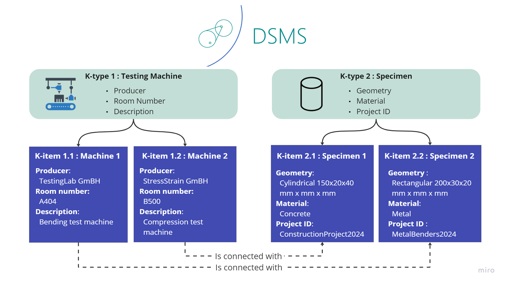

## Intoduction to DSMS

DSMS (acronym for Dataspace Management System) by Fraunhofer IWM is a web-based Data Managment platform that manages heterogeneous data and features using semantic and analytical capabilities.

### 1.Introduction

DSMS platform promotes and enables the provenance and catalogization of data through a combintation of classical relational databases and semantic technologies. By enabling the interoperabilty to third party data sources, Fraunhofer IWM demonstrates this though particular use cases in material science and manufacturing in public research projects for industry 4.0.

For the DSMS, Pydantic has been used extensively. Pydantic is a Python library that leverages type annotations for data validation and settings management. It ensures that data conforms to predefined schemas by validating or serializing it at runtime and thus facilitates strict type checking and data integrity.
In next chapters we look at the two most fundamental building blocks of DSMS which is KTypes and KItems.

### 1.1. KItems and KTypes

**What is a KType?**

KType stands for knowledge type and categorizes types of knowledge instances and what kind of associated details is relevant for a particular KType (as shown in the attached image). It basically describes a concept and its schema.

**What is a KItem?**

KItem stands for knowledge item and represents an individual instance of a KType following its property schema and functionalities. Knowledge items also capture the concepts of data containers and digital twin.

**How is it helpful?**

This approach streamlines the schematisation, conceptualization and structurisation of data for various domains and applications. Technically speaking, it builds an ideal base for the integration of data and knowledge into large dataspaces. KItems classified through KTypes didactically, support the upscaling of information into knowledge graphs by additional semantic annotations - which are usually mapped by ontologists.

KItems and KTypes embody the concepts of digital twins and data containers by providing a structured and semantic framework for representing real-world materials and processes in the manufacturing industry.

