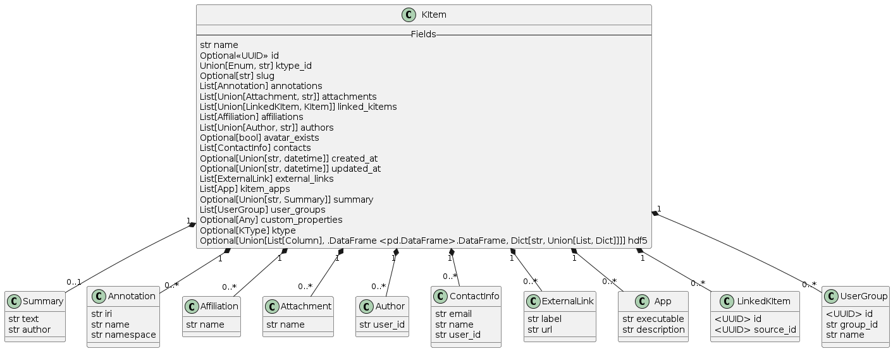

# DSMS KItem Schema

A Kitem has several properties (pydantic [`Fields`](https://docs.pydantic.dev/latest/concepts/fields/), simply referenced as `Fields` in the following) which enable it to handle data effectively. This section briefly describes the properties a Kitem can consist of, or in simple words, the schema of a KItem.

The schema contains complex types and references, indicating an advanced usage scenario where various objects (like KItems and their properties) are interconnected. It also includes customizations like optional and default values, arrays of references, and conditional formats (e.g., UUID formats).


## KItem Fields



| Field Name        | Description                                                                                              | Type                                              | Default  | Property Namespace | Required / Optional |
|:-----------------:|:--------------------------------------------------------------------------------------------------------:|:-------------------------------------------------:|:--------:|:------------------:|:-----------------:|
| Name              | Human-readable name of the KItem.                                                                       | string                                               | Not Applicable | `name`             | Required          |
| ID  | ID of the KItem | Union[UUID, string]                                                                                   | Not Applicable | `id`               | Optional          |
| Slug              | A unique slug identifier for the KItem, minimum of 4 characters.                                        | string                                               | `None`   | `slug`             | Optional          |
| Ktype ID          | The type ID of the KItem                                                                                | Union[Enum, string]                                  | Not Applicable | `ktype_id`         | Required          |
| Created At        | Timestamp of when the KItem was created.                                                                | Union[string, datetime]                              | `None`   | `created_at`       | Automatically generated          |
| Updated At        | Timestamp of when the KItem was updated.                                                                | Union[string, datetime]                              | `None`   | `updated_at`       | Automatically generated          |
| Avatar | The avatar of the KItem. | Union[[Avatar](#avatar-fields), Dict[str, Any]] | `None`   | `avatar`           | Optional          |
| Avatar Exists     | Whether the KItem holds an avatar or not.                                                               | boolean                                              | `False`  | `avatar_exists`    | Automatically generated          |
| Custom Properties | A set of custom properties related to the KItem.                                                        | Any                                               | `None`     | `custom_properties`| Optional          |
| Summary           | A brief human-readable summary of the KItem                                                             | string                              | `None`   | `summary`          | Optional          |
| KItem Apps        | A list of applications associated with the KItem                                                        | List[[App](#app-fields)]                                         | `[ ]`    | `kitem_apps`       | Optional          |
| Annotations       | A list of annotations related to the KItem                                                              | List[[Annotation](#annotation-fields)]                                  | `[ ]`    | `annotations`      | Optional          |
| Affiliations      | A list of affiliations associated with the KItem                                                        | List[[Affiliation](#affiliation-fields)]                                 | `[ ]`    | `affiliations`     | Optional          |
| Contacts          | Contact information related to the KItem                                                                | List[[ContactInfo](#contactinfo-fields)]                                 | `[ ]`    | `contacts`         | Optional          |
| External Links    | A list of external links related to the KItem                                                           | List[[ExternalLink](#externallink-fields)]                                | `[ ]`    | `external_links`   | Optional          |
| Attachments       | A list of file attachments associated with the KItem                                                    | List [Union [[Attachment](#attachment-fields)], string]                      | `[ ]`    | `attachments`      | Optional          |
| Dataframe             | Dataframe associated with the KItem, e.g. a time series                                                           | Union[List[[Column](#column-fields)], pd.DataFrame, Dictionary[string, Union[List, Dictionary]]] | `None`   | `dataframe`             | Optional          |
| Linked KItems     | List of other KItems linked to this KItem                                                               | List[Union[[LinkedKItem](#linkedkitem-fields), "KItem"]]                 | `[ ]` | `linked_kitems`    | Optional          |
| User Groups       | User groups with access to this KItem                                                                   | List[[UserGroup](#usergroup-fields)]                                   | `[ ]`    | `user_groups`      | Optional          |

### Example Usage
```python

item = KItem(
    name="Glass Bending machine 01",
    slug="1234",
    ktype_id="Testing Machine",
    custom_properties={"location": "Room01", "max_force": "100Pa"},
    summary="This is a summary",
    kitem_apps=[
        {"executable": "my_analysis_file",
        "title": "Analysis",
        "description": "Analysis the tensile strength from machine data"}
    ],
    annotations=["http://example.org/sample_kitem/annotation"],
    affiliations=[
        {"name": "Institute ABC"}
    ],
    contacts=[
        {"name": "John Doe", "email": "john.doe@example.com"}
    ],
    external_links=[
        {"label": "Project Website", "url": "https://example.com"}
    ],
    attachments=["research_data.csv"],
    linked_kitems=[another_kitem],
    user_groups=[
        {"group_id": "33305", "name": "DigiMaterials"}
    ]
)
```


## App Fields

| Sub-Property Name | Description                       | Type     | Default | Property Namespace | Required/Optional |
|:-----------------:|:---------------------------------:|:--------:|:-------:|:------------------:|:-----------------:|
| KItem App ID | ID of the KItem App               | integer    | `None`  | `kitem_app_id`     | Automatically generated |
| Executable        | Name of the executable            | string      | `None`  | `executable`       | Required          |
| Title             | Title of the application          | string      | `None`  | `title`            | Required          |
| Description       | Description of the application    | string      | `None`  | `description`     |Required          |
| Tags | Tags related to the application | Dict | `None` | `tags` | `tags` | Optional |
| Additional properties | Additional properties related to the application | [Additional Properties](#additional-properties-fields) | `None` | `additional_properties` | Optional |

### Example Usage
```python
sample_kitem.kitem_apps = [{
    "executable": "my_application",
    "title": "My Application",
    "description": "My Application for analysis.",
}]
```

## Additional Properties Fields

| Sub-Property Name | Description                       | Type     | Default | Property Namespace | Required/Optional |
|:-----------------:|:---------------------------------:|:--------:|:-------:|:------------------:|:-----------------:|
| Trigger Upon Upload | Whether the application is triggered when an attachment is uploaded | boolean      | `False` | `triggerUponUpload` | Optional          |
| Trigger Upon Extension | File extensions for which the upload shall be triggered | List[string] | `None`  | `triggerUponUploadFileExtensions` | Optional          |

### Example Usage
```python
item.kitem_apps = [
        {
            "executable": "my_yaml_file",
            "title": "Data2RDF",
            "additional_properties": {
                "triggerUponUpload": True,
                "triggerUponUploadFileExtensions": [".csv"],
            },
        }
    ]
```

## Annotation Fields

| Sub-Property Name | Description                       | Type     | Default | Property Namespace | Required/Optional |
|:-----------------:|:---------------------------------:|:--------:|:-------:|:------------------:|:-----------------:|
| IRI               | IRI of the annotation             | string      | Not Applicable  | `iri`              | Required          |
| Name              | Name of the annotation            | string      | Not Applicable | `name`             | Required          |
| Namespace         | Namespace of the annotation       | string      | Not Applicable  | `namespace`        | Required          |

### Example Usage
```python
sample_kitem.annotations = [
    "http://example.org/TensileTest"
]
```
```python
sample_kitem.annotations = [
    {
        "iri":"http://example.org/TensileTest",
        "name": "TensileTest",
        "namespace": "http://example.org"
    }
]
```

## Affiliation Fields

| Sub-Property Name | Description                       | Type     | Default | Property Namespace | Required/Optional |
|:-----------------:|:---------------------------------:|:--------:|:-------:|:------------------:|:-----------------:|
| Name              | Name of the affiliation           | string      | Not Applicable | `name`             | Required          |

### Example Usage
```python
sample_kitem.affiliations = [{"name": "Research BAC"}]
```

## Avatar Fields

| Sub-Property Name | Description                       | Type     | Default | Property Namespace | Required/Optional |
| :-----------------:|:---------------------------------:|:--------:|:-------:|:------------------:|:-----------------:|
| File | The file path to the image or PIL.Image object when setting a new avatar is set | Union[string, PIL.Image] | `None`  | `file` | Optional |
| Include QR code | Include QR code in the image | bool | `False` | `include_qr` | Optional |

### Example Usage
```python
sample_kitem.avatars = [
    {
        "file": "my_avatar.jpg",
        "include_qr": True
    }
]
```

## ContactInfo Fields

| Sub-Property Name | Description                       | Type          | Default | Property Namespace | Required/Optional |
|:-----------------:|:---------------------------------:|:-------------:|:-------:|:------------------:|:-----------------:|
| Email             | Email of the contact person       | string           | Not Applicable  | `email`            | Required          |
| Name              | Name of the contact person        | string           | Not Applicable  | `name`             | Required          |
| User Id           | User ID of the contact person     | string (UUID)     | `None`  | `user_id`          | Optional          |

### Example Usage
```python
sample_kitem.contacts = [
    {
        "email": "research.abc@gmail.com",
        "name": "project01@research.abc.de",
        "user_id":"33f24ee5-2f03-4874-854d-388af782c4c3"
    }
]
```

## ExternalLink Fields

| Sub-Property Name | Description                       | Type                       | Default | Property Namespace | Required/Optional |
|:-----------------:|:---------------------------------:|:--------------------------:|:-------:|:------------------:|:-----------------:|
| Label             | Label of the external link        | string                        | Not Applicable | `label`            | Required          |
| Url               | URL of the external link          | string , format: URI, minLength: 1 | Not Applicable  | `url`              | Required          |

### Example Usage
```python
sample_kitem.external_links = [
    {
        "label": "project link",
        "url": "www.projectmachine01.com"
    }
]
```


## Attachment Fields

| Sub-Property Name | Description                       | Type     | Default | Property Namespace | Required/Optional |
|:-----------------:|:---------------------------------:|:--------:|:-------:|:------------------:|:-----------------:|
| Name              | File name of the attachment       | string      | Not Applicable  | `name`             | Required          |
| Content | Content of the attachment           | string      | `None`  | `content`          | Optional          |

### Example Usage
```python
sample_kitem.attachments = ["research_data.csv"]
```

```python
sample_kitem.attachments = [
    {
        "name": "research_data.csv",
        "content": "A,B,C\n1,2,3\n4,5,6"
    }
]
```

## Column Fields

| Sub-Property Name | Description                       | Type     | Default | Property Namespace | Required/Optional |
|:-----------------:|:---------------------------------:|:--------:|:-------:|:------------------:|:-----------------:|
| Name              | Name of the column                | string      | Not Applicable | `name`             | Required          |
| Column ID         | ID of the column                  | integer     | Not Applicable  | `column_id`        | Required          |

### Example Usage
```python
sample_kitem.dataframe = {
    "A": [1, 4],
    "B": [2, 5],
    "C": [3, 6]
}
```


## LinkedKItem Fields

| Sub-Property Name | Description                       | Type          | Default | Property Namespace | Required/Optional |
|:-----------------:|:---------------------------------:|:-------------:|:-------:|:------------------:|:-----------------:|
| Id                | ID of the KItem to be linked      | string (UUID)     | `None`  | `id`               | Required          |
| Source Id         | Source Id of the KItem which has been linked | string (UUID)     | `None`  | `source_id`        | Required          |

### Example Usage
```python
sample_kitem.linked_kitems = [
    {
        "id": "3e894d2c-d1a5-42ca-b6e2-cbbc09e0e686", # id of the target KItem
    }
]
```
```python
sample_kitem.linked_kitems = [
    another_kitem
]
```

## UserGroup Fields

| Sub-Property Name | Description                       | Type          | Default | Property Namespace | Required/Optional |
|:-----------------:|:---------------------------------:|:-------------:|:-------:|:------------------:|:-----------------:|
| Id                | KItem ID related to the KItem property | string (UUID)     | `None`  | `id`               | Required          |
| Group Id          | ID of the user group              | string           | `None`  | `group_id`         | Required          |
| Name              | Name of the user group            | string           | `None`  | `name`             | Required          |

### Example Usage
```python
sample_kitem.user_groups = [
    {
        "group_id": "33305",
        "name": "22205"
    }
]
```
