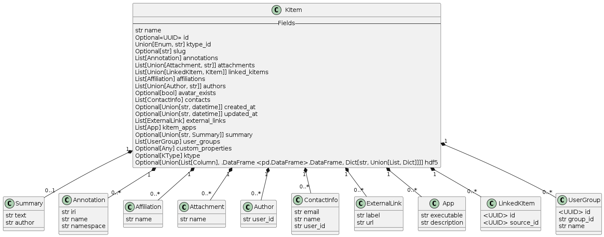

# DSMS KItem Schema

A Kitem has several properties (pydantic [`Fields`](https://docs.pydantic.dev/latest/concepts/fields/), simply referenced as `Fields` in the following) which enable it to handle data effectively. This section briefly describes the properties a Kitem can consist of, or in simple words, the schema of a KItem.

The schema contains complex types and references, indicating an advanced usage scenario where various objects (like KItems and their properties) are interconnected. It also includes customizations like optional and default values, arrays of references, and conditional formats (e.g., UUID formats).


## KItem Fields



`KItem` inherits the compacted base fields listed in [KItemCompactedModel fields](#kitemcompactedmodel-fields) below, and adds the following full-detail fields:

| Field Name        | Description                                                                                              | Type                                              | Default  | Property Namespace | Required / Optional |
|:-----------------:|:--------------------------------------------------------------------------------------------------------:|:-------------------------------------------------:|:--------:|:------------------:|:-----------------:|
| Name              | Human-readable name of the KItem.                                                                       | string                                               | Not Applicable | `name`             | Required          |
| ID  | ID of the KItem | Union[UUID, string]                                                                                   | Not Applicable | `id`               | Optional          |
| Slug              | A unique slug identifier for the KItem, minimum of 4 characters.                                        | string                                               | `None`   | `slug`             | Optional          |
| Ktype ID          | The type ID of the KItem                                                                                | Union[Enum, string]                                  | Not Applicable | `ktype_id`         | Required          |
| Created At        | Timestamp of when the KItem was created.                                                                | Union[string, datetime]                              | `None`   | `created_at`       | Automatically generated          |
| Updated At        | Timestamp of when the KItem was updated.                                                                | Union[string, datetime]                              | `None`   | `updated_at`       | Automatically generated          |
| Avatar | The avatar of the KItem. | Union[[Avatar](#avatar-fields), Dict[str, Any]] | `None`   | `avatar`           | Optional          |
| [KItemCustomPropertiesModel](#kitemcustompropertiesmodel) | A set of custom properties related to the KItem.                                                        | Any                                               | `None`     | `custom_properties`| Optional          |
| Summary           | A brief human-readable summary of the KItem                                                             | string                              | `None`   | `summary`          | Optional          |
| Apps        | A list of applications associated with the KItem                                                        | List[[App](#app-fields)]                                         | `[ ]`    | `apps`       | Optional          |
| Annotations       | A list of annotations related to the KItem                                                              | List[[Annotation](#annotation-fields)]                                  | `[ ]`    | `annotations`      | Optional          |
| Affiliations      | A list of affiliations associated with the KItem                                                        | List[[Affiliation](#affiliation-fields)]                                 | `[ ]`    | `affiliations`     | Optional          |
| Contacts          | Contact information related to the KItem                                                                | List[[ContactInfo](#contactinfo-fields)]                                 | `[ ]`    | `contacts`         | Optional          |
| External Links    | A list of external links related to the KItem                                                           | List[[ExternalLink](#externallink-fields)]                                | `[ ]`    | `external_links`   | Optional          |
| Attachments       | A list of file attachments associated with the KItem                                                    | List[Union[[Attachment](#attachment-fields), string]]                      | `[ ]`    | `attachments`      | Optional          |
| Dataframe             | Dataframe associated with the KItem, e.g. a time series                                                           | Union[List[[Column](#column-fields)], pd.DataFrame, Dictionary[string, Union[List, Dictionary]]] | `None`   | `dataframe`             | Optional          |
| Linked KItems     | List of other KItems linked to this KItem                                                               | List[Union[[LinkedKItem](#linkedkitem-fields), "KItem"]]                 | `[ ]` | `linked_kitems`    | Optional          |
| Contexts          | Context KItems this KItem belongs to                                                                    | List[Union[KItem, KItemCompactedModel]]                                  | `[ ]`    | `contexts`         | Optional          |
| Access Properties | Role-based access control entries for users and groups                                                  | [KItemAccessProperties](#kitemaccesrproperties-fields)                  | `None`   | `access_properties`| Optional          |
| Schema Data       | Semantic schema data entries (ontology-class instance data) associated with this KItem                  | List[[KItemSchemaData](#kitemschemeadata-fields)]                        | `None`   | `schema_data`      | Optional          |
| User Groups       | *(Legacy)* User groups with access to this KItem. Prefer `access_properties` for new code.             | List[[UserGroup](#usergroup-fields)]                                   | `[ ]`    | `user_groups`      | Optional          |
| Authors           | *(Deprecated)* Authorship list. No longer populated by the server; use `access_properties` instead.   | List[Author]                                                            | `[ ]`    | `authors`          | Deprecated        |
| RDF Exists        | *(Deprecated)* Whether the KItem holds an RDF graph. No longer populated by the server.               | boolean                                                                 | `False`  | `rdf_exists`       | Deprecated        |

## KItemCompactedModel Fields

`KItemCompactedModel` is the lightweight representation returned by the search endpoint. `KItem` extends it with all the full-detail fields listed above.

| Field Name             | Description                                                              | Type                  | Default | Property Namespace       | Required / Optional          |
|:----------------------:|:------------------------------------------------------------------------:|:---------------------:|:-------:|:------------------------:|:----------------------------:|
| Name                   | Human-readable name of the KItem.                                        | string                | —       | `name`                   | Required                     |
| ID                     | ID of the KItem.                                                         | UUID                  | auto    | `id`                     | Optional                     |
| Ktype ID               | The type ID of the KItem.                                                | Union[Enum, string]   | —       | `ktype_id`               | Required                     |
| Slug                   | A unique slug identifier, minimum 4 characters.                          | string                | `None`  | `slug`                   | Optional                     |
| Avatar Exists          | Whether the KItem holds an avatar or not.                                | boolean               | `False` | `avatar_exists`          | Automatically generated      |
| Has Contexts           | Whether the KItem belongs to at least one context.                       | boolean               | `False` | `has_contexts`           | Automatically generated      |
| Attachment Extensions  | Unique file extensions present in this KItem's attachments.              | List[string]          | `None`  | `attachment_extensions`  | Automatically generated      |

### Example Usage
```python
item = KItem(
    name="Glass Bending machine 01",
    slug="1234",
    ktype_id="Testing Machine",
    custom_properties={"location": "Room01", "max_force": "100Pa"},
    summary="This is a summary",
    apps=[
        {
            "executable": "my_analysis_file",
            "title": "Analysis",
            "description": "Analyse the tensile strength from machine data",
        }
    ],
    annotations=["http://example.org/sample_kitem/annotation"],
    affiliations=[{"name": "Institute ABC"}],
    contacts=[{"name": "John Doe", "email": "john.doe@example.com"}],
    external_links=[{"label": "Project Website", "url": "https://example.com"}],
    attachments=["research_data.csv"],
    linked_kitems=[another_kitem],
    access_properties={
        "user_access": [{"user_id": "abc-123", "role": 3}],
        "group_access": [{"group_id": "g-456", "role": 1}],
    },
    schema_data=[
        {"schema_id": "https://example.org/ontology/MyClass", "content": {"key": "value"}}
    ],
)
```


## App Fields

| Sub-Property Name | Description                       | Type     | Default | Property Namespace | Required/Optional |
|:-----------------:|:---------------------------------:|:--------:|:-------:|:------------------:|:-----------------:|
| KItem App ID | ID of the KItem App               | integer    | `None`  | `kitem_app_id`     | Automatically generated |
| Executable        | Name of the executable            | string      | `None`  | `executable`       | Required          |
| Title             | Title of the application          | string      | `None`  | `title`            | Required          |
| Description       | Description of the application    | string      | `None`  | `description`     |Required          |
| Tags | Tags related to the application | Dict | `None` | `tags` | `tags` | Optional |
| Additional properties | Additional properties related to the application | [Additional Properties](#additional-properties-fields) | `None` | `additional_properties` | Optional |

### Example Usage
```python
sample_kitem.apps = [{
    "executable": "my_application",
    "title": "My Application",
    "description": "My Application for analysis.",
}]
```

## Additional Properties Fields

| Sub-Property Name | Description                       | Type     | Default | Property Namespace | Required/Optional |
|:-----------------:|:---------------------------------:|:--------:|:-------:|:------------------:|:-----------------:|
| Trigger Upon Upload | Whether the application is triggered when an attachment is uploaded | boolean      | `False` | `triggerUponUpload` | Optional          |
| Trigger Upon Extension | File extensions for which the upload shall be triggered | List[string] | `None`  | `triggerUponUploadFileExtensions` | Optional          |

### Example Usage
```python
item.apps = [
        {
            "executable": "my_yaml_file",
            "title": "Data2RDF",
            "additional_properties": {
                "triggerUponUpload": True,
                "triggerUponUploadFileExtensions": [".csv"],
            },
        }
    ]
```

## Annotation Fields

| Sub-Property Name | Description                       | Type     | Default | Property Namespace | Required/Optional |
|:-----------------:|:---------------------------------:|:--------:|:-------:|:------------------:|:-----------------:|
| IRI               | IRI of the annotation             | string      | Not Applicable  | `iri`              | Required          |
| Name              | Name of the annotation            | string      | Not Applicable | `name`             | Required          |
| Namespace         | Namespace of the annotation       | string      | Not Applicable  | `namespace`        | Required          |

### Example Usage
```python
sample_kitem.annotations = [
    "http://example.org/TensileTest"
]
```
```python
sample_kitem.annotations = [
    {
        "iri":"http://example.org/TensileTest",
        "name": "TensileTest",
        "namespace": "http://example.org"
    }
]
```

## Affiliation Fields

| Sub-Property Name | Description                       | Type     | Default | Property Namespace | Required/Optional |
|:-----------------:|:---------------------------------:|:--------:|:-------:|:------------------:|:-----------------:|
| Name              | Name of the affiliation           | string      | Not Applicable | `name`             | Required          |

### Example Usage
```python
sample_kitem.affiliations = [{"name": "Research BAC"}]
```

## Avatar Fields

| Sub-Property Name | Description                       | Type     | Default | Property Namespace | Required/Optional |
| :-----------------:|:---------------------------------:|:--------:|:-------:|:------------------:|:-----------------:|
| File | The file path to the image or PIL.Image object when setting a new avatar is set | Union[string, PIL.Image] | `None`  | `file` | Optional |
| Include QR code | Include QR code in the image | bool | `False` | `include_qr` | Optional |

### Example Usage
```python
sample_kitem.avatars = [
    {
        "file": "my_avatar.jpg",
        "include_qr": True
    }
]
```

## ContactInfo Fields

| Sub-Property Name | Description                       | Type          | Default | Property Namespace | Required/Optional |
|:-----------------:|:---------------------------------:|:-------------:|:-------:|:------------------:|:-----------------:|
| Email             | Email of the contact person       | string           | Not Applicable  | `email`            | Required          |
| Name              | Name of the contact person        | string           | Not Applicable  | `name`             | Required          |
| User Id           | User ID of the contact person     | string (UUID)     | `None`  | `user_id`          | Optional          |

### Example Usage
```python
sample_kitem.contacts = [
    {
        "email": "research.abc@gmail.com",
        "name": "project01@research.abc.de",
        "user_id":"33f24ee5-2f03-4874-854d-388af782c4c3"
    }
]
```

## ExternalLink Fields

| Sub-Property Name | Description                       | Type                       | Default | Property Namespace | Required/Optional |
|:-----------------:|:---------------------------------:|:--------------------------:|:-------:|:------------------:|:-----------------:|
| Label             | Label of the external link        | string                        | Not Applicable | `label`            | Required          |
| Url               | URL of the external link          | string , format: URI, minLength: 1 | Not Applicable  | `url`              | Required          |

### Example Usage
```python
sample_kitem.external_links = [
    {
        "label": "project link",
        "url": "www.projectmachine01.com"
    }
]
```


## Attachment Fields

| Sub-Property Name | Description                       | Type     | Default | Property Namespace | Required/Optional |
|:-----------------:|:---------------------------------:|:--------:|:-------:|:------------------:|:-----------------:|
| Name              | File name of the attachment       | string      | Not Applicable  | `name`             | Required          |
| Content | Content of the attachment           | string      | `None`  | `content`          | Optional          |

### Example Usage
```python
sample_kitem.attachments = ["research_data.csv"]
```

```python
sample_kitem.attachments = [
    {
        "name": "research_data.csv",
        "content": "A,B,C\n1,2,3\n4,5,6"
    }
]
```

## Column Fields

| Sub-Property Name | Description                       | Type     | Default | Property Namespace | Required/Optional |
|:-----------------:|:---------------------------------:|:--------:|:-------:|:------------------:|:-----------------:|
| Name              | Name of the column                | string      | Not Applicable | `name`             | Required          |
| Column ID         | ID of the column                  | integer     | Not Applicable  | `column_id`        | Required          |

### Example Usage
```python
sample_kitem.dataframe = {
    "A": [1, 4],
    "B": [2, 5],
    "C": [3, 6]
}
```


## LinkedKItem Fields

| Sub-Property Name | Description                       | Type          | Default | Property Namespace | Required/Optional |
|:-----------------:|:---------------------------------:|:-------------:|:-------:|:------------------:|:-----------------:|
| Id                | ID of the KItem to be linked      | string (UUID)     | `None`  | `id`               | Required          |
| Source Id         | Source Id of the KItem which has been linked | string (UUID)     | `None`  | `source_id`        | Required          |

### Example Usage
```python
sample_kitem.linked_kitems = [
    {
        "id": "3e894d2c-d1a5-42ca-b6e2-cbbc09e0e686", # id of the target KItem
    }
]
```
```python
sample_kitem.linked_kitems = [
    another_kitem
]
```

## UserGroup Fields

| Sub-Property Name | Description                       | Type          | Default | Property Namespace | Required/Optional |
|:-----------------:|:---------------------------------:|:-------------:|:-------:|:------------------:|:-----------------:|
| Id                | KItem ID related to the KItem property | string (UUID)     | `None`  | `id`               | Required          |
| Group Id          | ID of the user group              | string           | `None`  | `group_id`         | Required          |
| Name              | Name of the user group            | string           | `None`  | `name`             | Required          |

### Example Usage
```python
sample_kitem.user_groups = [
    {
        "group_id": "33305",
        "name": "22205"
    }
]
```

## KItemAccessProperties Fields

`KItemAccessProperties` controls who can access a KItem. It has three orthogonal mechanisms:

- **Visibility** — a single field that grants read access to broad audiences without requiring explicit role assignments.
- **User access** — per-user role assignments for fine-grained control.
- **Group access** — per-Keycloak-group role assignments.

### Visibility Values

| Value       | Who can read                                      |
|:-----------:|:-------------------------------------------------:|
| `private`   | Only users and groups listed in access properties |
| `internal`  | All authenticated users                           |
| `public`    | Everyone (no login required)                      |

### Role Values

| Role name     | Integer value | Permitted operations                          |
|:-------------:|:-------------:|:---------------------------------------------:|
| `MEMBER`      | 1             | READ                                          |
| `CONTRIBUTOR` | 2             | READ, UPDATE                                  |
| `OWNER`       | 3             | READ, UPDATE, DELETE, MANAGE                  |

### KItemAccessProperties Sub-fields

| Field Name    | Description                                       | Type                             | Default     | Property Namespace | Required/Optional |
|:-------------:|:-------------------------------------------------:|:--------------------------------:|:-----------:|:------------------:|:-----------------:|
| Visibility    | Broad read-access level                           | `"private"` \| `"internal"` \| `"public"` | `"private"` | `visibility` | Optional |
| User Access   | Per-user role assignments                         | List[[UserAccessProperty](#useraccessproperty-fields)] | `[]` | `user_access` | Optional |
| Group Access  | Per-group role assignments (special visibility groups excluded) | List[[GroupAccessProperty](#groupaccessproperty-fields)] | `[]` | `group_access` | Optional |

### UserAccessProperty Fields

| Field Name | Description             | Type   | Default        | Property Namespace | Required/Optional |
|:----------:|:-----------------------:|:------:|:--------------:|:------------------:|:-----------------:|
| User ID    | UUID of the user        | string | Not Applicable | `user_id`          | Required          |
| Role       | Role assigned to user   | int (1–3) or Role name | Not Applicable | `role` | Required |

### GroupAccessProperty Fields

| Field Name | Description             | Type   | Default        | Property Namespace | Required/Optional |
|:----------:|:-----------------------:|:------:|:--------------:|:------------------:|:-----------------:|
| Group ID   | UUID of the group       | string | Not Applicable | `group_id`         | Required          |
| Role       | Role assigned to group  | int (1–3) or Role name | Not Applicable | `role` | Required |

### Example Usage
```python
from dsms.knowledge.properties.access import KItemAccessProperties, Role

# Make an item readable by all authenticated users, with one explicit owner
item.access_properties = KItemAccessProperties(
    visibility="internal",
    user_access=[{"user_id": "abc-123", "role": Role.OWNER}],
)

# Grant a specific group contributor access on a private item
item.access_properties = KItemAccessProperties(
    visibility="private",
    user_access=[{"user_id": "abc-123", "role": Role.OWNER}],
    group_access=[{"group_id": "g-456", "role": Role.CONTRIBUTOR}],
)

# Query which users can perform a given operation
from dsms.knowledge.properties.access import OperationType
print(item.access_properties.operation_by_user[OperationType.UPDATE])

# Look up the minimum role required to delete
from dsms.knowledge.properties.access import RoleMapping
print(RoleMapping.min_access_level(OperationType.DELETE))  # Role.OWNER
```

## KItemSchemaData Fields

`KItemSchemaData` stores a single semantic schema instance attached to a KItem. Each entry maps an ontology-class IRI (the `schema_id`) to a free-form content dictionary.

| Field Name | Description                                     | Type                  | Default        | Property Namespace | Required/Optional |
|:----------:|:-----------------------------------------------:|:---------------------:|:--------------:|:------------------:|:-----------------:|
| Schema ID  | Ontology class IRI that identifies the schema   | string                | Not Applicable | `schema_id`        | Required          |
| Content    | Free-form instance data for that schema         | Dict[string, Any]     | `None`         | `content`          | Optional          |

### Example Usage
```python
item.schema_data = [
    {
        "schema_id": "https://example.org/ontology/TensileTest",
        "content": {"strain_rate": 0.001, "temperature_K": 293},
    }
]

# Access by schema ID
from dsms.knowledge.properties.schema_data import KItemSchemaDataList
entries = KItemSchemaDataList(item.schema_data)
test_entry = entries.by_schema_id["https://example.org/ontology/TensileTest"]
```

## KItemCustomPropertiesModel

| Sub-Property Name | Description                       | Type     | Default | Property Namespace | Required/Optional |
|:-----------------:|:---------------------------------:|:--------:|:-------:|:------------------:|:-----------------:|
| Sections          | Sections of custom properties     | List of [CustomPropertiesSection](#custompropertiessection-fields) | `[]`  | `sections`         | Optional           |


## CustomPropertiesSection Fields

| Sub-Property Name | Description                       | Type     | Default | Property Namespace | Required/Optional |
|:-----------------:|:---------------------------------:|:--------:|:-------:|:------------------:|:-----------------:|
| Id                | Id of the section                 | string or null | `None` | `id`               | Optional           |
| Name              | Name of the section               | string    | `None`  | `name`             | Required           |
| Entries           | Entries of the section            | List of [Entry](#entry-fields) | `[]`  | `entries`          | Optional           |

## Entry Fields

| Sub-Property Name | Description                       | Type     | Default | Property Namespace | Required/Optional |
|:-----------------:|:---------------------------------:|:--------:|:-------:|:------------------:|:-----------------:|
| Id                | Id of the entry                   | string    | `None`  | `id`               | Optional          |
| Type              | Type of the entry                 | [Widget](#widget-fields) or null | `None`  | `type`             | Optional          |
| Label             | Label of the entry                | string    | `None`  | `label`            | Required          |
| Value             | Value of the entry                | any or null | `None`  | `value`            | Optional          |
| Measurement Unit  | Measurement unit of the entry     | [MeasurementUnit](#measurementunit-fields) or null | `None`  | `measurementUnit`  | Optional          |
| Relation Mapping  | Relation mapping of the entry     | [RelationMapping](#relationmapping-fields) or null | `None`  | `relationMapping`  | Optional          |
| Required          | Required input                    | boolean or null | `False` | `required`         | Optional          |
| KItem ID          | ID of the knowledge item          | string or null | `None`  | `kitemId`          | Optional          |

## MeasurementUnit Fields

| Sub-Property Name | Description                       | Type     | Default | Property Namespace | Required/Optional |
|:-----------------:|:---------------------------------:|:--------:|:-------:|:------------------:|:-----------------:|
| IRI               | IRI of the measurement unit       | string or null | `None`  | `iri`              | Optional          |
| Label             | Label of the measurement unit     | string or null | `None`  | `label`            | Optional          |
| Symbol            | Symbol of the measurement unit    | string or null | `None`  | `symbol`           | Optional          |
| Namespace         | Namespace of the measurement unit | string or null | `None`  | `namespace`        | Optional          |

## RelationMapping Fields

| Sub-Property Name | Description                       | Type     | Default | Property Namespace | Required/Optional |
|:-----------------:|:---------------------------------:|:--------:|:-------:|:------------------:|:-----------------:|
| IRI               | IRI of the annotation             | string or null | `None`  | `iri`              | Optional          |
| Type              | Type of the annotation            | [RelationMappingType](#relationmappingtype-fields) or null | `None`  | `type`             | Optional          |
| Class IRI         | Class IRI for object properties   | string or null | `None`  | `classIri`         | Optional          |

## RelationMappingType Fields

| Value                | Description            |
|:--------------------:|:----------------------:|
| `object_property`    | Object property type   |
| `data_property`      | Data property type     |
| `annotation_property`| Annotation property type|
| `property`           | General property type  |

## Widget Fields

| Value              | Description                                  |
|:------------------:|:--------------------------------------------:|
| `Array group`      | Repeating group of fields                    |
| `Checkbox`         | Boolean checkbox widget                      |
| `Date`             | Date picker widget                           |
| `Date-time`        | Date and time picker widget                  |
| `File`             | File upload widget                           |
| `Key-value pairs`  | Free-form key/value map widget               |
| `Knowledge item`   | Knowledge item selector widget               |
| `LaTeX`            | LaTeX-rendered text widget                   |
| `Multi-select`     | Multi-select dropdown widget                 |
| `Number`           | Numeric input widget                         |
| `Radio`            | Radio button widget                          |
| `Select`           | Dropdown select widget                       |
| `Slider`           | Slider input widget                          |
| `Star rating`      | Star-rating widget                           |
| `Text`             | Single-line text input widget                |
| `Textarea`         | Multi-line text input widget                 |
| `URL`              | URL input widget                             |
| `Vocabulary select`| Controlled-vocabulary term selector widget   |
