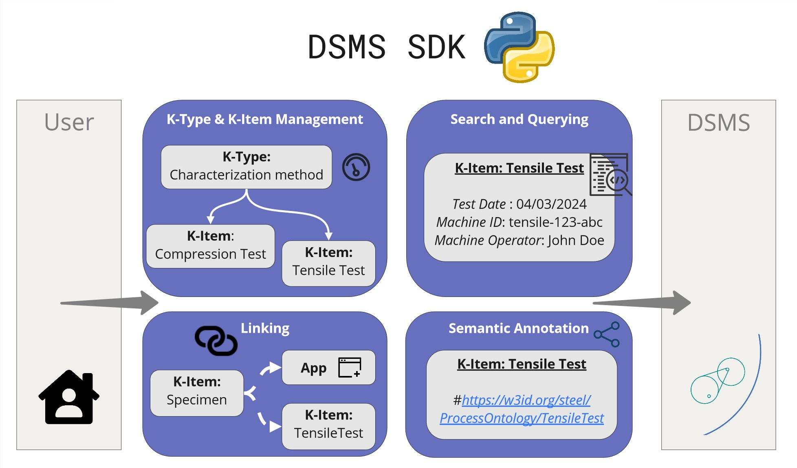
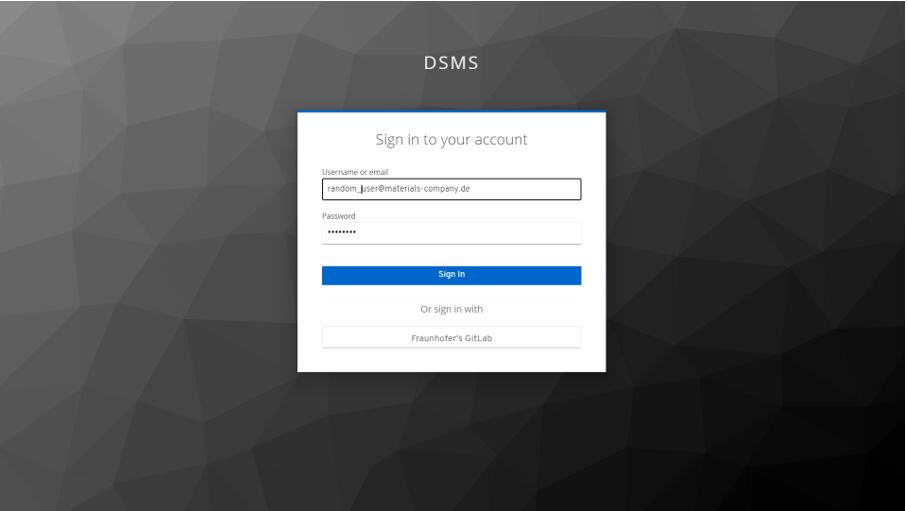
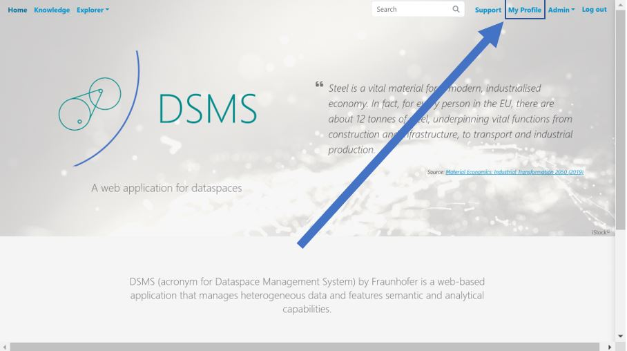
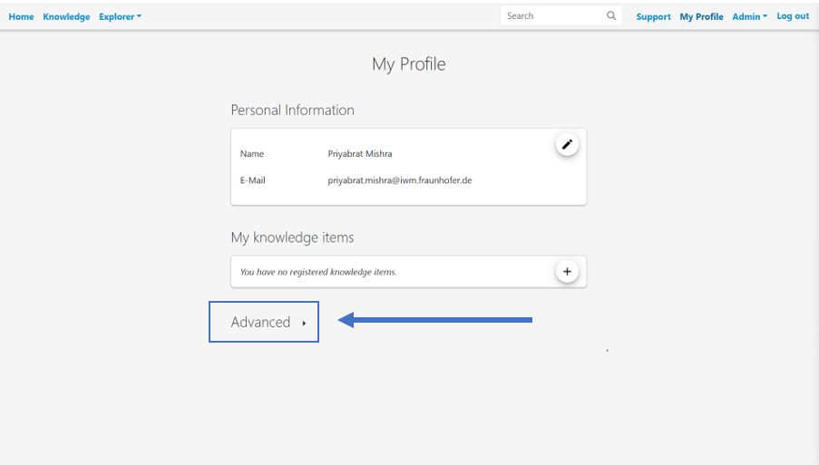
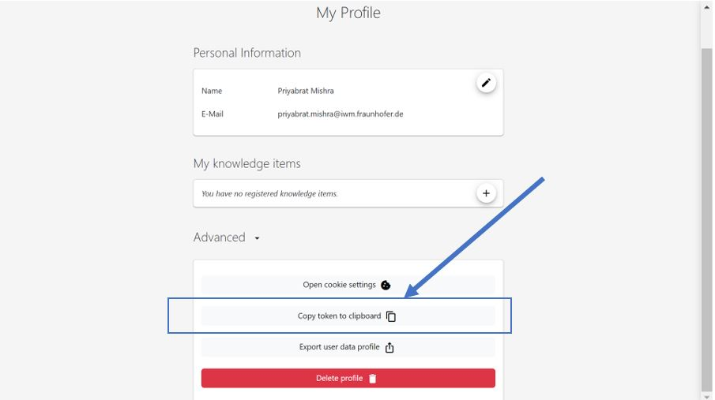

# About DSMS-SDK

## 1. Overview

**What is the DSMS SDK?**

SDK stands for Software Development Kit. In our case, it is a Python-based package for the interaction with the DSMS. This means that all fundamental functionalities of the DSMS can be accessed through a Python interface now!

**How does the SDK work?**

Just install it on your local system via the pip command line interface:

```bash
pip install dsms-sdk
```

... and start connecting to your central DSMS instance remotely, e.g. by integrating it into your own Python scripts and packages

The SDK functionalities are listed below:
1. Managing Knowledge-Items.
2. Creating, updating and deleting meta data and properties, e.g. date, operator, material response data for a conducted tensile test.
3. Administrating authorship, contact information and supplementary information.
4. Semantic annotation of K-Items.
5. Conduct simple free-text searches and SPARQL queries.
6. Linking K-Items to other K-Items.
7. Linking Apps to K-Items, triggered, for example, during a file upload.
8. Performing simple file upload and download of file attachments.
9. Export of a knowledge (sub) graph into TTL/JSON-LD.


Click on the link to go to the Github repository of the Python based DSMS-SDK : [Git repo](https://github.com/MI-FraunhoferIWM/dsms-python-sdk)



## 2. Installation

### Installation and Setup Guide

How to install and setup the dsms-python-sdk.

### Pre-Requisites

Before using DSMS-SDK make sure to register an account in a DSMS Instance of your choice. You could do this by sending an email to the following contacts:

- [Yoav Nahshon](mailto:yoav.nahshon@iwm.fraunhofer.de) (Fraunhofer Institute for Mechanics of Materials IWM)
- [Matthias Büschelberger](mailto:matthias.bueschelberger@iwm.fraunhofer.de) (Fraunhofer Institute for Mechanics of Materials IWM)

After following the above steps, you could use either of the two ways to install DSMS-SDK to your machine.

### Compatibility

Please take the compability of the SDK version with the DSMS version into account:

| SDK Version | DSMS Version |
| --- | --- |
| <2.0.0 | <2.0.0 |
| >=2.0.0, <3.0.0 | >=2.0.0, <3.0.0 |
| >=3.0.0, <3.0.4 | >=3.0.0, <3.0.5 |
| >=3.0.4, <3.1.0 | >=3.0.5, <3.1.0 |
| >=3.1.0, <3.2.2 | >=3.1.0, <3.2.1 |
| >=3.2.2 | >=3.2.1, <4.0.0 |
| >=4.0.0 | >=4.0.0 |


#### Method 1: Via PyPI

To install the [DSMS Python SDK](https://pypi.org/project/dsms-sdk/), you can use the Python Package Index (PyPI). Copy the below command to install DSMS SDK from PyPI:

```bash
pip install dsms-sdk
```

#### Method 2: Cloning Github Repo

Download and install on th8e local machine :

```bash
git clone git@github.com:MI-FraunhoferIWM/dsms-python-sdk.git
cd dsms-python-sdk
pip install .
```

### Connecting to DSMS

You need to authenticate yourself to connect with dsms using the `dsms-sdk` Python package which can be done by following one of the below given steps:

1. **Pick the DSMS host of your choice.**

   The following are the instances of the DSMS you could choose from:

   - [StahlDigital](https://lnkd.in/gfwe9a36)
   - [KupferDigital](https://lnkd.in/g8mvnM3K)
   - [DiMAT](https://lnkd.in/g46baB6J)

2. **Authentication Options**

   You can log into the DSMS core using one of the following methods:

    **a.** **Pass as Keyword Arguments**

      Directly pass your credentials (stored in a .env file) as keyword arguments when initializing the SDK.

      ```python
      from dsms import DSMS
      dsms = DSMS(env="../.env")
      ```

      Then add the relevant information in the .env file for setting up the login with DSMS core via SDK. Here, we choose the stahldigital instance for demo:

     ```
     DSMS_HOST_URL = https://stahldigital.materials-data.space
     DSMS_USERNAME = {YOUR_USERNAME}
     DSMS_PASSWORD = {YOUR_PASSWORD}
     ```

      Now save the file and the user is ready to connect with DSMS-Core via SDK.

    **b.** **Pass Config Variables while Initialization**

      Use configuration variables during initialization. Use the `getpass` module for securely entering your password.

      ```python
       import getpass
       from dsms import DSMS
       dsms_host = "https://stahldigital.materials-data.space"
       dsms_username = input("Enter your username: ")
       dsms_password = getpass.getpass("Enter your password: ")

       dsms = DSMS(host=dsms_host, username=dsms_username, password=dsms_password)
      ```

    **c. Using Frontend and get token**:

      The user can login in the DSMS instance of choice and then use the login token, which can be obtained by following the below steps from the DSMS frontend interface.

      Step 1: Login into the selected dataspace instance of your choice.

      

      Step 2: Enter your credentials

      

      Step 3: After logging in you will land up on the home page. Now proceed to the my profile option

      

      Step 4: The my profile option should look something like below. Now click on Advanced.

      

      Step 5: After landing up on Advanced section, click on the copy token to clipboard

      

      Step 6: Now the login token is in the clipboard. Now paste the copied login token from the frontend in the DSMS_TOKEN attribute of the .env file
      ```
      DSMS_HOST_URL = https://stahldigital.materials-data.space
      DSMS_TOKEN = {YOUR_COPIED_TOKEN}
      ```

Now you are ready to use dsms-sdk. Do check out the tutorials section to try out some basic examples on how to use dsms-sdk.

The next sections covers about the schema of fundamental classes crucial for users to know about DSMS when using the platform. Below given explains about the Schema of `KItem` and its associated properties in DSMS.

Now the next section gives a brief explanation about the Schema of `Config` class of DSMS and its associated properties in DSMS.
