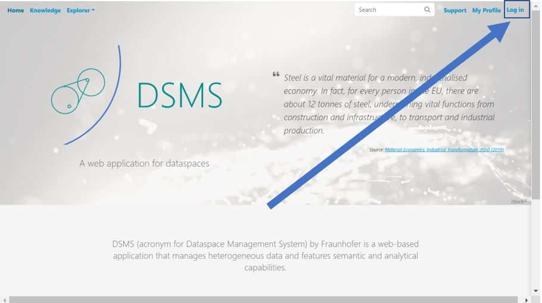
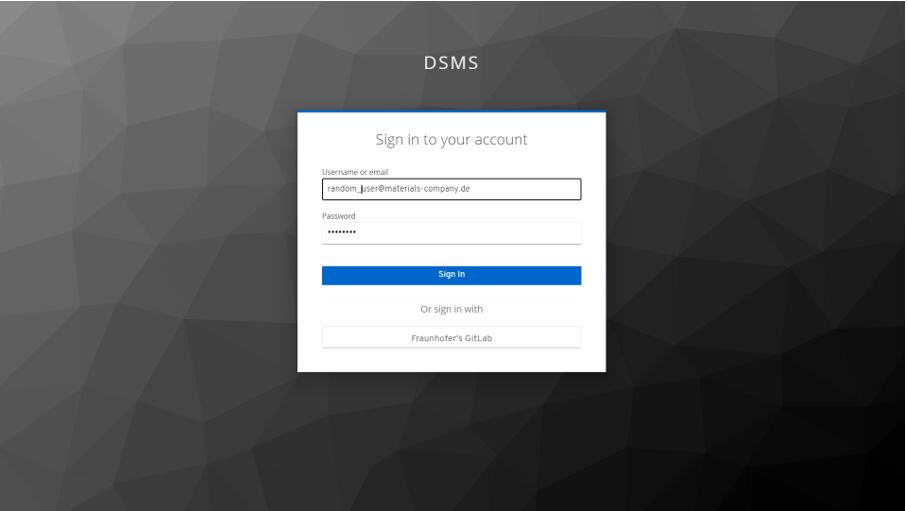
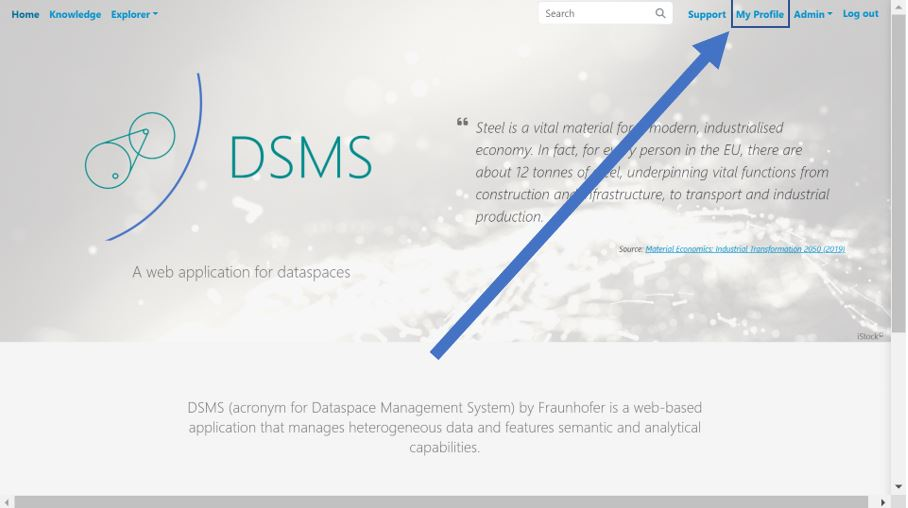
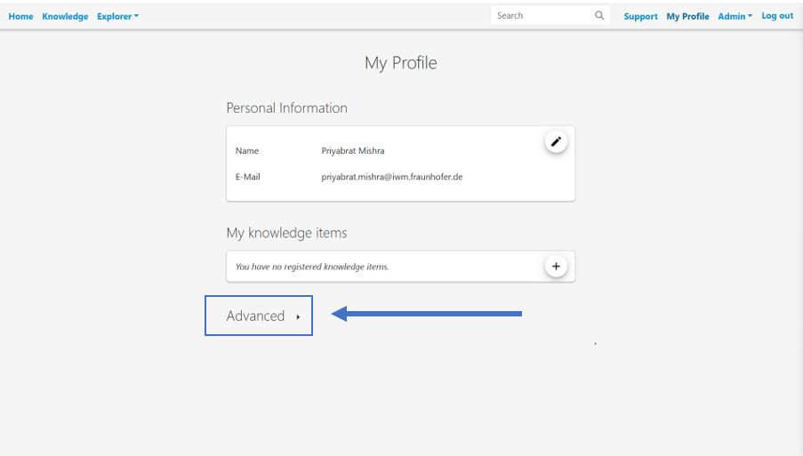
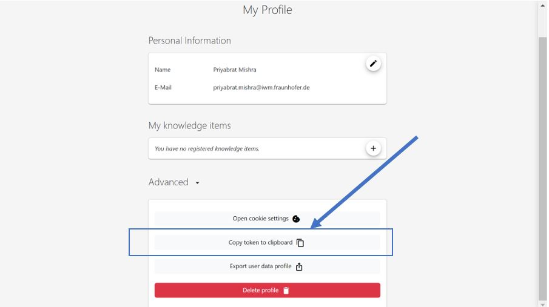

# Installation and Setup Guide
How to install and setup the dsms-python-sdk.

## 1.1. Installation

Before using DSMS-SDK make sure to register your account at your DSMS Instance.You could do this by sending an email to the following contacts:

- [Yoav Nahshon](mailto:yoav.nahshon@iwm.fraunhofer.de) (Fraunhofer Institute for Mechanics of Materials IWM)
- [Matthias Büschelberger](mailto:matthias.bueschelberger@iwm.fraunhofer.de) (Fraunhofer Institute for Mechanics of Materials IWM)

After following the above steps, you could use either of the two ways to install DSMS to your machine.

#### Method 1 : Via PyPI ####

To install the [DSMS Python SDK](https://pypi.org/project/dsms-sdk/), you can use the Python Package Index (PyPI).
Copy the below command to install DSMS SDK from PyPI
- `pip install dsms-sdk`

#### Method 2 : Cloning Github Repo ####

Install in your folder (or any folder you like).

- `git clone git@github.com:MI-FraunhoferIWM/dsms-python-sdk.git`
- `cd dsms-python-sdk`
- `pip install .`

## 1.2. Additional Setup
You need to authenticate yourself to connect with dsms-core using dsms-python-sdk.

Therefore follow the following process:
1. **Pick the DSMS host of your choice.**

    The following are the instances of the DSMS you could choose from:

- [StahlDigital](https://lnkd.in/gfwe9a36)
- [KupferDigital](https://lnkd.in/g8mvnM3K)
- [DiMAT](https://lnkd.in/g46baB6J)

2. **Add the relevant information in the .env file for setting up the login with DSMS core via SDK.**

    Step 1 : Create a .env file in the following folders

        a. {path_to_dsms-python-sdk}/dsms-python-sdk/.env

        b. {path_to_dsms-python-sdk}/dsms-python-sdk/docs/source/.env

    Step 2 : Populate both the .env file with the following information. Here, we choose the  stahldigital instance for demo :

        DSMS_HOST_URL = https://stahldigital.materials-data.space
        DSMS_USERNAME = {YOUR_USERNAME}
        DSMS_PASSWORD = {YOUR_PASSWORD}

    Now Save the file and the user is ready to connect with DSMS-Core via SDK.

**3. How to get the token  [Optional]**

    Step 1: Login into the selected data.space instance of your choice.

    Step 2: Enter your credentials

    Step 3: After logging in you will land up in the home page. Now look at the my profile option

    Step 4: The my profile option should look something like below. Now click on the Advanced.

    Step 5: The Advanced section should like the below. Now click on the copy token to clipboard

    Step 6: Now paste it in DSMS_TOKEN attribute of the .env file in root/dsms-python-sdk.

Now you are ready to use dsms-sdk. Do check out the tutorials section to try out on some basic examples on how to use dsms-sdk.
