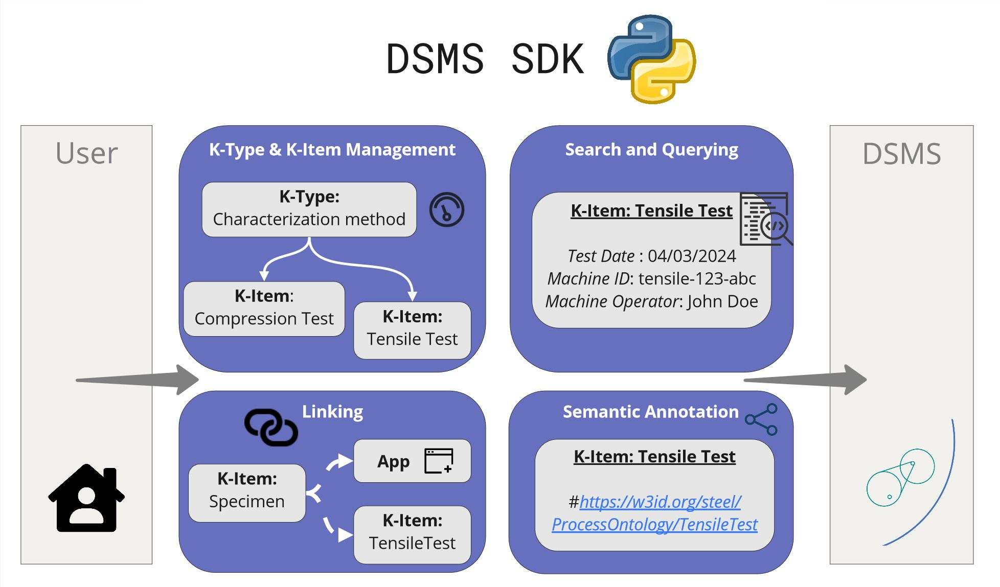
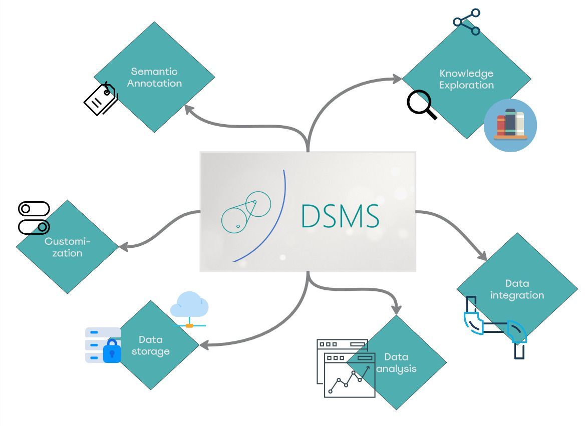
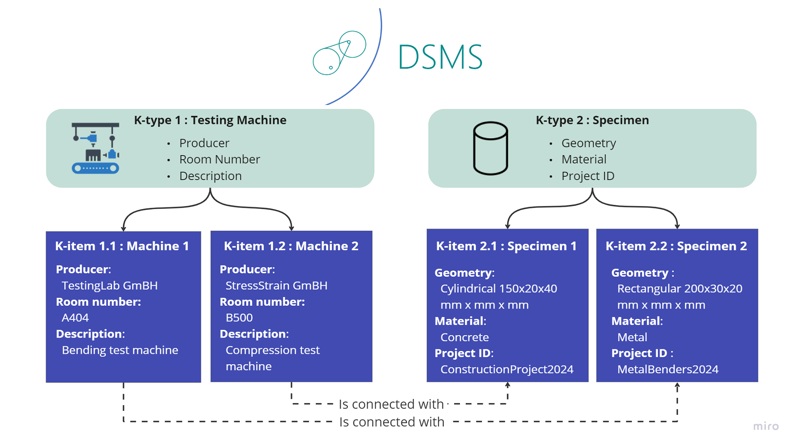

# Introduction to DSMS-SDK
## 1.1. Overview

In the dynamic world of Material Science, the introduction of our latest development brings a new way of interaction with our Dataspace Management System (DSMS): The DSMS Python SDK.

**What is the DSMS SDK?**

SDK stands for Software Development Kit. In our case, it is a Python-based package for the interaction with the DSMS. This means that all fundamental functionalities of the DSMS can be accessed through a Python interface now!

**How does the SDK work?**

Just install it on your local system via the pip command line interface:

`pip install dsms-sdk`

... and start connecting to your central DSMS instance remotely, e.g. by integrating it into your own Python scripts and packages

The SDK functionalities are listed below:
1. Managing Knowledge-Items.
2. Creating, updating and deleting meta data and properties, e.g. date, operator, material response data for a conducted tensile test.
3. Administrating authorship, contact information and supplementary information.
4. Semantic annotation of K-Items.
5. Conduct simple free-text searches and SPARQL queries.
6. Linking K-Items to other K-Items.
7. Linking Apps to K-Items, triggered, for example, during a file upload.
8. Performing simple file upload and download of file attachments.
9. Export of a knowledge (sub) graph into TTL/JSON-LD.
[Git repo](https://github.com/MI-FraunhoferIWM/dsms-python-sdk)

## 1.2. DSMS

DSMS (acronym for Dataspace Management System) by Fraunhofer is a web-based application that manages heterogeneous data and features semantic and analytical capabilities.

### 1.2.1. Introduction

DSMS platform promotes and enables the provenance and catalogization of data through a combintation of classical relational databases and semantic technologies. By enabling the interoperabilty to third party data sources, Fraunhofer IWM demonstrates this though particular use cases in material science and manufacturing in public research projects for industry 4.0.

### 1.2.2. KItems and KTypes

**What is K-type?**

K-type stands for knowledge type and categorizes types of knowledge instances and what kind of details are relevant for them (as shown in the attached image). It basically describes a concept and its schema.

**What is K-item?**

K-item stands for knowledge item and represents an individual instance of a k-type following its property schema and functionalities. Knowledge items also capture the concepts of data containers and digital twin.

**How is it helpful?**

This approach streamlines the schematisation, conceptualization and structurisation of data for various domains and applications. Technically speaking, it builds an ideal base for the integration of data and knowledge into large dataspaces. K-Items classify through K-Types didactically, support the upscaling of information into knowledge graphs by additional semantic annotations - which are usually mapped by ontologists.

K-Items and K-Types embody the concepts of digital twins and data containers by providing a structured and semantic framework for representing real-world materials and processes in the manufacturing industry.

### 1.2.3. Kitem Properties

A Kitem has several properties to enable to handle data effectively. This section briefly describes the properties a Kitem can consist or in simple words the schema of a K-item.

The schema contains complex types and references, indicating an advanced usage scenario where various objects (like KItems and their properties) are interconnected. It also includes customizations like optional and default values, arrays of references, and conditional formats (e.g., UUID formats).

For the DSMS, Pydantic has been used extensively. Pydantic is a Python library that leverages type annotations for data validation and settings management. It ensures that data conforms to predefined schemas by validating or serializing it at runtime and thus facilitates strict type checking and data integrity.

Below given is the details of the schema of a Kitem for better understanding:

#### KItem Schema Documentation ####

All the below kitem schema elements have id which is automatically generated which has the type - `UUID`.

##### 1. KItem #####

**Description:** Represents a Knowledge Item within the DSMS system.

**Properties:**
- **name**: Human-readable name of the KItem.
- **slug**: A unique slug identifier for the KItem, minimum of 4 characters.
- **ktype_id**: The type ID of the KItem.
- **created_at**: Timestamp of when the KItem was created.
- **updated_at**: Timestamp of when the KItem was last updated.
- **summary**: A brief human-readable summary of the KItem.
- **avatar_exists**: Indicates whether the KItem has an avatar image associated with it.
- **custom_properties**: A set of custom properties related to the KItem.
- **kitem_apps**: A list of applications associated with the KItem.
- **annotations**: A list of annotations related to the KItem.
- **affiliations**: A list of affiliations associated with the KItem.
- **authors**: A list of authors related to the KItem.
- **contacts**: Contact information related to the KItem.
- **external_links**: A list of external links related to the KItem.
- **attachments**: A list of file attachments associated with the KItem.
- **hdf5**: HDF5 data structure associated with the KItem.
- **linked_kitems**: List of other KItems linked to this KItem.
- **user_groups**: User groups with access to this KItem.

**Required Fields:** `name`, `ktype_id`

##### 2. App #####

**Description:** Represents an application associated with a KItem.

**Properties:**
- **executable**: Name of the executable file related to the app.
- **description**: Description of the application.
- **title**: Title of the application.
- **kitemAppId**: ID of the KItem App.
- **tags**: Tags related to the application.
- **additionalProperties**: Additional properties specific to the application.

**Required Fields:** `executable`

##### 3.Annotation #####

**Description:** Represents an annotation within a KItem.

**Properties:**
- **iri**: IRI of the annotation.
- **name**: Name of the annotation.
- **namespace**: Namespace of the annotation.

**Required Fields:** `iri`, `name`, `namespace`

##### 4.Affiliation #####

**Description:** Represents an affiliation associated with a KItem.

**Properties:**
- **name**: Name of the affiliation.

**Required Fields:** `name`

##### 5.Author #####

**Description:** Represents an author of a KItem.

**Properties:**
- **userId**: DSMS User ID of the author.

**Required Fields:** `userId`

##### 6.Attachment #####

**Description:** Represents a file attachment within a KItem.

**Properties:**
- **name**: File name of the attachment.

**Required Fields:** `name`

##### 7.External Link #####

**Description:** Represents an external link associated with a KItem.

**Properties:**
- **label**: Label of the external link.
- **url**: URL of the external link.

**Required Fields:** `label`, `url`

##### 8.KType #####

**Description:** Represents the type of knowledge encapsulated in a KItem.

**Properties:**
- **name**: Human-readable name of the KType.
- **data_schema**: OpenAPI schema of the KItem.
- **form_data**: Form data of the KItem.

**Required Fields:** `id`

##### 9.User Group #####

**Description:** Represents a user group associated with a KItem.

**Properties:**
- **groupId**: ID of the user group.
- **name**: Name of the user group.

**Required Fields:** `name`, `groupId`
